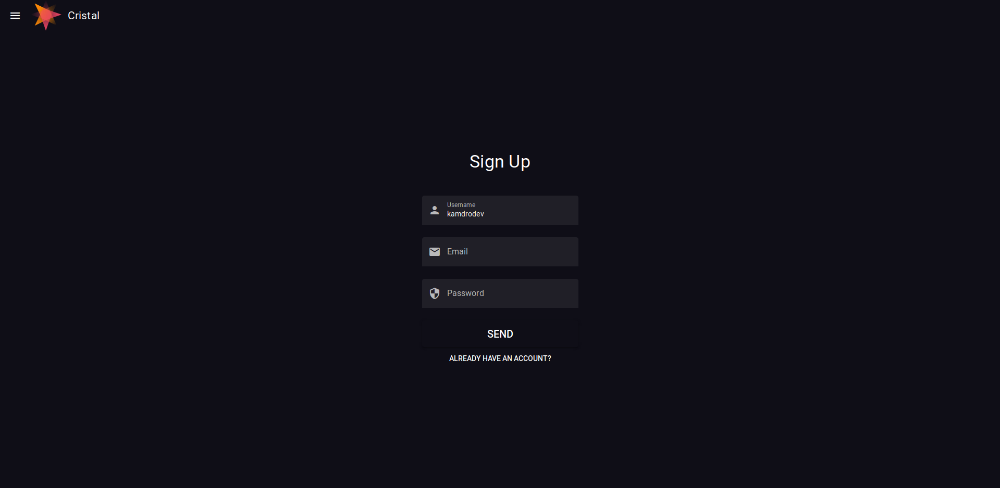
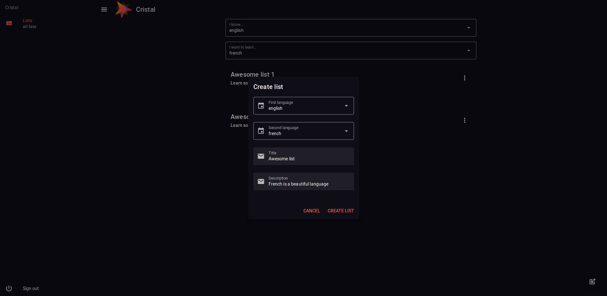
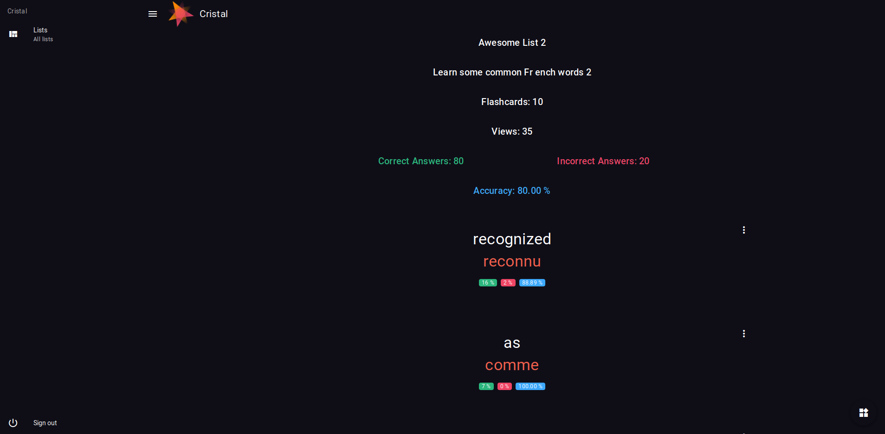
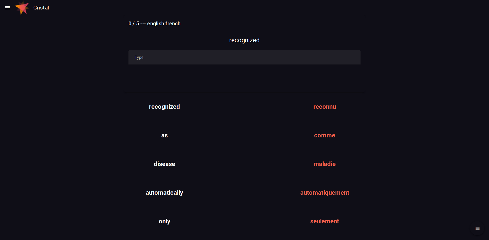

 

# Cristal

## Language learning application.
Create your own word vocabulary lists. Learn languages with flashcards and control your progress.

## Screenshots






## Client

## Tools
* Vue (Vuex)
* Quasar
* Sass

## Project setup
```
npm install
```

### Compiles and hot-reloads for development
```
quasar dev
```

### Compiles and minifies for production
```
quasar build
```
### Customize configuration
See [Configuration Reference](https://cli.vuejs.org/config/).

## Server

## Tools
* Node.js
* Express
* MongoDB
* Mongoose

## Project setup
```
npm install
```

### Compiles and hot-reloads for development
```
npm run dev
```

### Compiles and minifies for production
```
npm run build
```

### Deployment
```
npm run serve
```
